# Oxidized Oracle 🦀 + 📡 + 🔗


**Oxidized Oracle** is a high-performance, decentralized bridge between the physical world and the Solana Blockchain. It solves the "Oracle Problem" for IoT by enforcing cryptographic integrity at the hardware edge.

---

## ⚡ Key Features

- **🚀 Blazing Fast**: Written in Rust using `Tokio` and `Rumqttc` for asynchronous performance.
- **🔒 Edge Security**: Uses Ed25519 signing. The private key never leaves the IoT device.
- **📡 Real-Time**: Full MQTT support with instantaneous feedback loops.
- **💎 Trustless**: Data is verified cryptographically before being hashed and committed to Solana.
- **🔄 Feedback Loop**: The device receives the Solana Transaction URL immediately after confirmation.

---

## 🏗️ Architecture

The system uses a bidirectional flow to ensure data integrity and transparency.

```mermaid
sequenceDiagram
    autonumber
    participant Device as 🤖 IoT Device (ESP32)
    participant Broker as ☁️ MQTT Broker
    participant Oracle as 🦀 Oxidized Oracle
    participant Solana as 🔗 Solana Blockchain

    Note over Device: 1. Read Sensor Data<br/>2. Sign Payload (Ed25519)
    Device->>Broker: Publish to "sensor/data"
    Broker->>Oracle: Forward Message
    
    Oracle->>Oracle: 🛑 Verify Signature & Timestamp
    
    alt Signature Valid
        Oracle->>Solana: Submit Memo Transaction (Data Hash)
        Solana-->>Oracle: Transaction Confirmed (Tx Signature)
        
        Note over Oracle: Create Receipt
        Oracle->>Broker: Publish Receipt to "oracle/response"
        Broker->>Device: Forward Receipt (Tx URL)
        Device->>Device: ✅ Display Confirmation
    else Signature Invalid
        Oracle->>Broker: Log Error
    end
```



---

## 🚀 Getting Started

### Prerequisites
- **Rust Toolchain**: `curl --proto '=https' --tlsv1.2 -sSf https://sh.rustup.rs | sh`
- **Solana Tool Suite** (Optional, for creating wallets)

### 1. Configuration
Copy the example environment file and configure it.

```bash
cp .env.example .env
```

Edit `.env`:
```ini
# MQTT Configuration
MQTT_HOST=your.hivemq.cloud
MQTT_PORT=8883
MQTT_USERNAME=user
MQTT_PASSWORD=pass
MQTT_CLIENT_ID=oxidized-oracle-server
MQTT_TOPIC=sensor/data

# Solana Configuration
SOLANA_RPC_URL=https://api.devnet.solana.com
# Your Wallet Keypair as a JSON Byte Array (e.g., from solana-keygen new)
SOLANA_WALLET_KEY=[123, 45, ...] 
```

### 2. Run the Oracle (Backend)
Start the server to listen for MQTT messages.
```bash
cargo run
```

### 3. Run the Simulator (Fake IoT)
In a separate terminal, run the simulator to pretend to be an ESP32 device.
```bash
cargo run --example fake_iot
```
*The simulator will generate random data, sign it, sending it to the Oracle, and wait for the Solana confirmation URL.*

---

## 📂 Project Structure

- `src/main.rs`: Entry point and runtime initialization.
- `src/config.rs`: Centralized configuration loading (Env + Wallet).
- `src/api/mqtt.rs`: Async MQTT event loop handler.
- `src/crypto/verify.rs`: Ed25519 verification and Timestamp logic.
- `src/solana/client.rs`: Solana transaction builder.
- `examples/fake_iot.rs`: A complete simulator for testing/demo purposes.

---

Built with ❤️ by **[@singulaarityy](https://github.com/singulaarityy) and **[@yasaa7z](https://github.com/yasaa7z)**.
